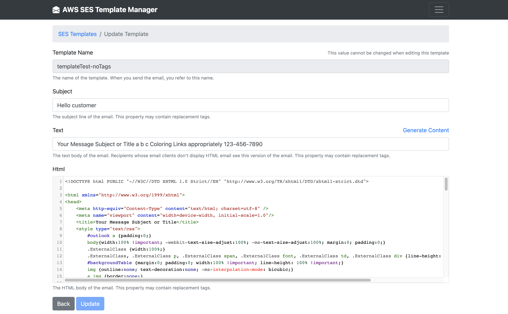

# AWS SES Template Manager GUI [](https://twitter.com/intent/tweet?url=https%3A%2F%2Fgithub.com%2FMattRuddick%2Faws-ses-template-manager%0a%0a&text=A%20simple%20productivity%20tool%20presenting%20a%20user%20interface%20around%20the%20AWS%20SES%20command%20line%20interface.%20This%20application%20allows%20for%20quick%20and%20easy%20reviewing%2C%20creating%2C%20updating%20and%20deleting%20of%20%23AWS%20%23SES%20templates%3A&hashtags=AwsSes%2CSesTemplates%2CSesGui)
[](https://github.com/MattRuddick/aws-ses-template-manager/releases)
[](https://github.com/tterb/atomic-design-ui/blob/master/LICENSEs)
[](http://makeapullrequest.com)
## Features
A simple productivity tool presenting a user interface around the AWS SES command line interface. This application allows 
for **quick and easy reviewing, creating, updating and deleting of AWS SES templates** within any region.

Other useful features include:
- SES template **duplication**.
- Syntax highlighting for the HTML body of your emails.
- **Send test emails** for your template including adding values for any replacement tags you may have implemented.
- Be **notified of any newer versions** of this application to always ensure you have the latest features.

See [installation instructions](#Installation) to get started.

## Motivation
AWS currently only allows CRUD actions on SES templates via the command line. Performing these actions especially for multiple templates 
can be time consuming and in some cases inefficient depending the volumes of templates you're managing. A simple GUI application 
allowing the user to quickly perform these actions without need to run multiple CLI commands can be more efficient in some cases.

## Screenshots
Review templates per region:


Create/Update template:



## Tech / framework used

- AdonisJS
- Bootstrap 4

## Installation
- Ensure to have [setup your AWS credentials](https://docs.aws.amazon.com/sdk-for-java/v1/developer-guide/setup-credentials.html) on your machine.
- git clone this project repo.
- ```npm install```
- Ensure 'AWS_PROFILE_NAME' within the **.env file** is set to your desired aws named profile. Also ensure for the named profile chosen that all applicable permissions are granted to allow for creating, retrieving, updating, deleting and sending SES templates.
- ```adonis serve --dev``` will run the application.

## How to use
Once installation steps have been followed, navigate to http://127.0.0.1:3333 (host and port can be changed via the .env file if required).

The index page will show a table of existing SES templates in your selected region using the AWS named profile specified in the .env file. You can further go ahead and either delete 
or edit an SES template from this same table.

## Staying up to date


The application will **automatically** check to see if you are using the latest release version. If you are not, then you will get 
a visual prompt to let you know there is a newer version of the app available (as shown above in the top left). This is a great way to stay 
up to date with new features etc.

You can easily get the latest changes by:
- running the command: ```git pull``` 
- stop and restarting adonis (```adonis serve --dev```)
- closing and re-opening your local browser tab

You can click on the 'new version available' button to access the newer versions release notes.
Some updates may include additional dependencies. In which case ```npm install``` is advised in the release notes.

## Contribute

Pull requests are very much welcomed.

## License
MIT @ [Matthew Ruddick](https://github.com/MattRuddick)

[]()
